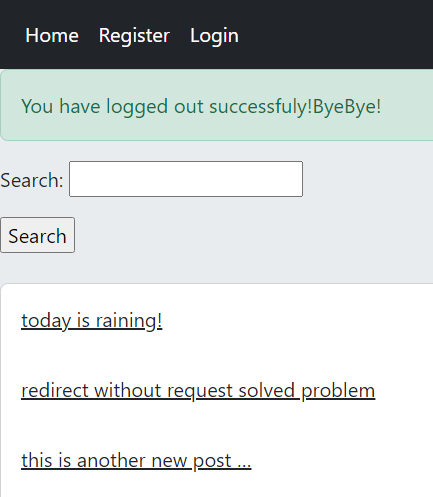

# Django Social Network

This is an educational **django v4**  project from Mongard course.

## features
In this app you can register, login (by username or email) and logout.
After login, you can see all post created by other users and search among them.By clicking on user, you will go to his/her profile and you can follow him/her!
Also you can comment and reply bellow other posts/comment and read other comments/replies.
Dont forget liking posts that you like!only one like you can give for each post!
In your profile,you can send new post.your username and your own posts are shown too.
By clicking on each post, you can see details of it and if it was your own post, you can update or delete it too!
If you forget your password, don't worry at all! we will reset it by sending secure link to your email!

all in all, this app has these features:
- register, login, logout, profile
- post/comment/reply/like
- password recovery

## Some Implementation Details

For better implementation we use Class Based View.Admin pannel was costumized for showing posts.
Also frontend improved by **Bootstrap**
confirming pasword was done by overwriting clean() validator
using get_absolute_url instead of template tag.
overwriting setup for view was used to reduce number of connection to database.
Error handeling for non-defined urls (404) was done,but for activating you must change debug=False in setting.py.
we ordere posts based on created time (newest first) by adding class Meta in Post model.
when you click on other user profile before log in, you first redirect to login page, and then to user profile that you had clicked. this was implemented by using 'next' in url.
we extended pre-built User model in order to contain profile (bio and age) by using admin.UserAdmi and StackInline. It needs signals to create profile when ever user created.

